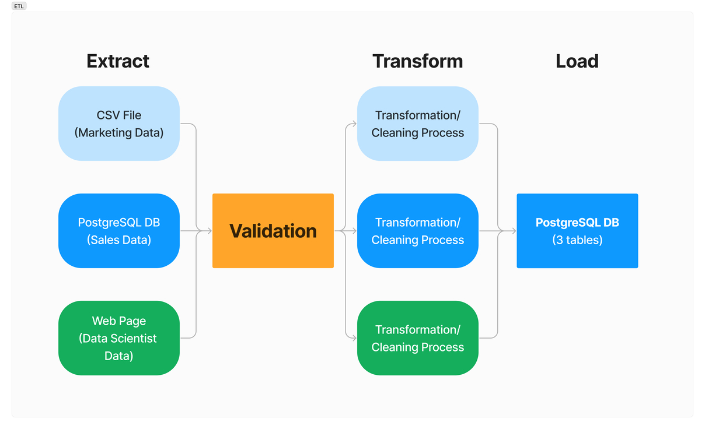
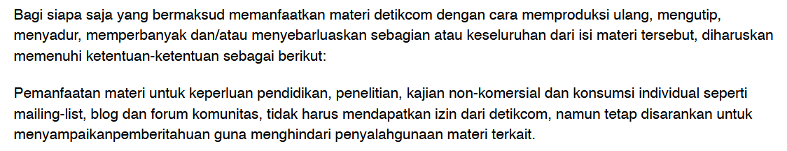
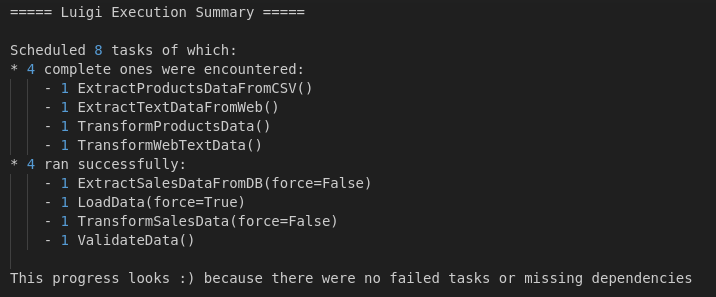
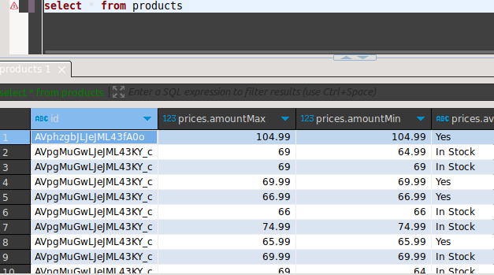
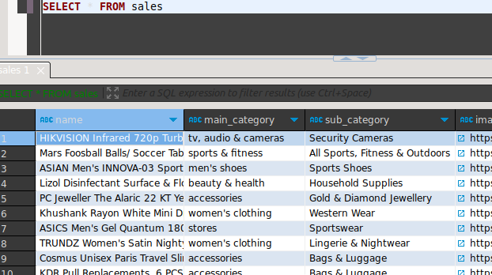
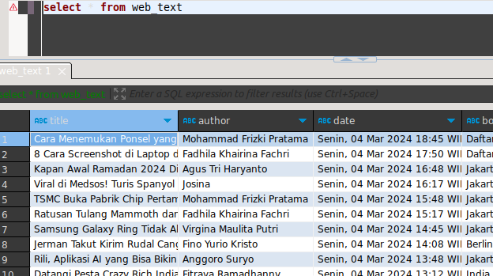
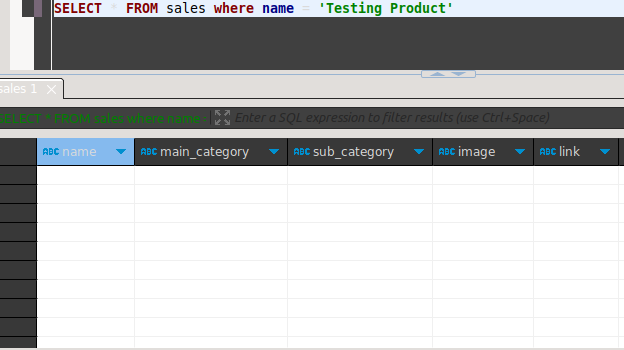
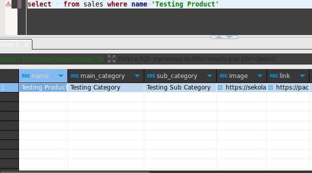

## Background

A data engineer is required to build an ETL pipeline to address data issues for other departments.

### Sales Team

The sales team has data stored in a PostgreSQL database, but the data contains many missing values and is formatted incorrectly.

### Product Team

The product team has electronic product pricing data in a CSV file, however the data is in poor condition and requires significant cleaning.

### Data Scientist Team

The data scientist team needs data to build a Natural Language Processing (NLP) model, but currently lacks access to any.

## Project Explanation

### Requirements Gathering & Proposed Solution

The challenge:

1. Existing sales and marketing data require further processing to be usable.
2. Text data needed for the NLP model is currently unavailable.

The solution:

1. __ETL pipeline development.__ Extract data from existing sales and marketing sources and then transform the extracted data to a usable format, extract relevant text data from a website using web scraping and clean it for NLP use, and finally load all transformed data into a single, centralized data source.
2. __Scheduling.__ Implement a scheduler to ensure the pipeline runs regularly and automatically.

### ETL Pipeline Design

The pipeline follows an ETL procedure:

- Extract
- Transform
- Load



During the __Extraction__ phase, data is extracted from three available sources: a CSV file, a PostgreSQL database, and a website. Data from the CSV file and the database is directly extracted using `pandas` methods for reading CSV files and database queries, respectively. Data from the website is obtained through web scraping using a combination of `requests` and `Beautiful Soup` libraries. All the data is then converted into `pandas` DataFrames for further processing.

Following extraction, the DataFrames undergo a __Validation__ process to inspect data details such as shape (count of rows and columns), data types of each column, and the presence of missing values.

Next, the DataFrames proceed to the __Transformation__ phase where they undergo processing to meet project requirements. The process is utilizing `pandas` methods to clean the data, replace missing values, drop unnecessary columns, and perform other necessary transformations.

Finally, the transformed DataFrames are loaded into distinct tables within a PostgreSQL database during the __Load__ phase.

### ETL Implementation

This project is using `luigi` as a tool to build an ETL pipeline.

#### Extraction

Extracting data from a CSV file:

```py
import luigi

class ExtractProductsDataFromCSV(luigi.Task):
    def requires(self):
        pass

    def run(self):
        pass

    def output(self):
        return luigi.LocalTarget("/home/mad4869/Documents/pacmann/data-engineering/etl-pipeline/data/raw/products_data.csv")
```

Extracting data from a PostgreSQL database:

```py
import pandas as pd
import psycopg2
import os
from dotenv import load_dotenv

load_dotenv()


def extract_db() -> pd.DataFrame:
    DB_NAME = os.getenv("DB_NAME")
    DB_USER = os.getenv("DB_USER")
    DB_PASSWORD = os.getenv("DB_PASSWORD")
    DB_HOST = os.getenv("DB_HOST")
    DB_PORT = os.getenv("DB_PORT")

    conn = psycopg2.connect(
        dbname=DB_NAME, user=DB_USER, password=DB_PASSWORD, host=DB_HOST, port=DB_PORT
    )

    query = "SELECT * FROM amazon_sales_data"

    df = pd.read_sql(query, conn)

    conn.close()

    return df
```

```py
from extract.extract_db import extract_db

class ExtractSalesDataFromDB(ForceableTask):
    def requires(self):
        pass

    def run(self):
        df = extract_db()

        df.to_csv(self.output().path, index=False)

    def output(self):
        return luigi.LocalTarget("/home/mad4869/Documents/pacmann/data-engineering/etl-pipeline/data/raw/sales_data.csv")
```

Extracting data from a website is accomplished by scraping the __Detikinet__ website (inet.detik.com). Detik was selected for convenience reason and because their policy allows the use of their content for non-commercial purposes.



Source: [detik.com](https://www.detik.com/copyright)

```py
import requests
import pandas as pd
from bs4 import BeautifulSoup


def extract_web() -> pd.DataFrame:
    URL = "https://inet.detik.com/indeks"

    full_data = []

    for page in range(1, 10):
        resp = requests.get(f"{URL}/{page}")
        if resp.status_code == 200:
            soup = BeautifulSoup(resp.text, "html.parser")

            # get all the articles
            medias = soup.find_all("div", class_="media")

            for media in medias:
                # get the article's link
                link = media.find("a", class_="media__link")
                href = link.get("href")

                # filter out videos and pictures articles
                if "20.detik.com" not in href and "fotoinet" not in href:
                    content = requests.get(href)
                    content_soup = BeautifulSoup(content.text, "html.parser")
                    content_detail = content_soup.find("article", class_="detail")

                    if content_detail:
                        content_title = (
                            content_detail.find("h1", class_="detail__title").text
                            or None
                        )
                        content_author = (
                            content_detail.find("div", class_="detail__author").text
                            or None
                        )
                        content_date = (
                            content_detail.find("div", class_="detail__date").text
                            or None
                        )

                        content_body = (
                            content_detail.find("div", class_="detail__body").text
                            or None
                        )

                        content_data = {
                            "title": content_title,
                            "author": content_author,
                            "date": content_date,
                            "body": content_body,
                        }

                        full_data.append(content_data)

    df = pd.DataFrame(full_data)

    return df
```

```py
from extract.extract_web import extract_web

class ExtractTextDataFromWeb(luigi.Task):
    def requires(self):
        pass

    def run(self):
        df = extract_web()

        df.to_csv(self.output().path, index=False)

    def output(self):
        return luigi.LocalTarget("/home/mad4869/Documents/pacmann/data-engineering/etl-pipeline/data/raw/web_text_data.csv")
```

#### Validation

Validating the raw data:

```py
import pandas as pd


def validate_data(df: pd.DataFrame, table: str) -> None:
    print("========== Start Pipeline Validation ==========")
    print("")

    # get shape of the dataframe
    n_rows = df.shape[0]
    n_cols = df.shape[1]

    print(f"Tabel {table} memiliki {n_rows} baris dan {n_cols} kolom")
    print("")

    cols = df.columns

    # get datatype for each column
    for col in cols:
        print(f"Kolom {col} memiliki tipe data {df[col].dtypes}")

    print("")

    # check missing values in each column
    for col in cols:
        missing_values_pct = (df[col].isnull().sum() * 100) / len(df)
        print(
            f"Kolom {col} memiliki missing values sebanyak {missing_values_pct}% dari total data"
        )

    print("")
    print("========== End Pipeline Validation ==========")
```

```py
from validate.validate_data import validate_data

class ValidateData(luigi.Task):
    def requires(self):
        return [
            ExtractProductsDataFromCSV(),
            ExtractSalesDataFromDB(),
            ExtractTextDataFromWeb(),
        ]

    def run(self):
        tables = ["PRODUCTS", "SALES", "WEB TEXT"]

        for index, table in enumerate(tables):
            df = pd.read_csv(self.input()[index].path)

            validate_data(df, table)

    def output(self):
        return [
            luigi.LocalTarget("/home/mad4869/Documents/pacmann/data-engineering/etl-pipeline/data/validated/products_data.csv"),
            luigi.LocalTarget("/home/mad4869/Documents/pacmann/data-engineering/etl-pipeline/data/validated/sales_data.csv"),
            luigi.LocalTarget("/home/mad4869/Documents/pacmann/data-engineering/etl-pipeline/data/validated/web_text_data.csv"),
        ]
```

#### Transformation

Transforming the product data involves dropping unnecessary columns and filling missing values.

```py
import pandas as pd


def transform_products_data(df: pd.DataFrame) -> pd.DataFrame:
    # drop unnecessary columns
    columns_to_drop = [
        "ean",
        "Unnamed: 26",
        "Unnamed: 27",
        "Unnamed: 28",
        "Unnamed: 29",
        "Unnamed: 30",
    ]

    df.drop(columns=columns_to_drop, inplace=True)

    # fill missing values
    df.fillna("Not Found", inplace=True)

    return df
```

```py
from transform.transform_products_data import transform_products_data

class TransformProductsData(luigi.Task):
    def requires(self):
        return ExtractProductsDataFromCSV()

    def run(self):
        df = pd.read_csv(self.input().path)

        transformed_df = transform_products_data(df)

        transformed_df.to_csv(self.output().path, index=False)

    def output(self):
        return luigi.LocalTarget("/home/mad4869/Documents/pacmann/data-engineering/etl-pipeline/data/transformed/products_data.csv")
```

Transforming the sales data involves dropping unnecessary columns and rows, and filling missing values.

```py
import pandas as pd


def transform_sales_data(df: pd.DataFrame) -> pd.DataFrame:
    # drop unnecessary columns
    columns_to_drop = ["Unnamed: 0"]

    df.drop(columns=columns_to_drop, inplace=True)

    # drop rows with missing actual price
    df.dropna(subset=["actual_price"], inplace=True)

    # fill missing values
    df.fillna(0, inplace=True)

    return df
```

```py
from transform.transform_sales_data import transform_sales_data

class TransformSalesData(ForceableTask):
    def requires(self):
        return ExtractSalesDataFromDB()

    def run(self):
        df = pd.read_csv(self.input().path)

        transformed_df = transform_sales_data(df)

        transformed_df.to_csv(self.output().path, index=False)

    def output(self):
        return luigi.LocalTarget("/home/mad4869/Documents/pacmann/data-engineering/etl-pipeline/data/transformed/sales_data.csv")
```

Transforming the web data involves cleaning the text from irrelevant subjects and standardizing the format.

```py
import re
import pandas as pd


def transform_web_text_data(df: pd.DataFrame) -> pd.DataFrame:
    # clean the name of authors
    df["author"] = df["author"].str.replace(" - detikInet", "")

    # clean the title and the body
    df["title"] = df["title"].str.strip()
    df["body"] = df["body"].str.strip()

    # create a function to clean the acquired text
    def cleaning_text(text: str) -> str:
        # remove whitespace
        text_wo_whitespace = re.sub(r"\s+", " ", text)
        # add space after period
        proper_sentences = re.sub(r"\.([a-zA-Z]+)\b", r". \1", text_wo_whitespace)
        # split paragraph into sentences
        sentences = proper_sentences.split(". ")
        # filter irrelevant sentences
        filtered_sentences = filter(
            lambda sentence: "ADVERTISEMENT" not in sentence
            and "Baca juga:" not in sentence
            and "Simak Video" not in sentence,
            sentences,
        )
        # join the sentences back into a full text
        cleaned_text = ". ".join(filtered_sentences)

        return cleaned_text

    df["body"] = df["body"].apply(cleaning_text)

    return df
```

```py
from transform.transform_web_text_data import transform_web_text_data

class TransformWebTextData(luigi.Task):
    def requires(self):
        return ExtractTextDataFromWeb()

    def run(self):
        df = pd.read_csv(self.input().path)

        transformed_df = transform_web_text_data(df)

        transformed_df.to_csv(self.output().path, index=False)

    def output(self):
        return luigi.LocalTarget("/home/mad4869/Documents/pacmann/data-engineering/etl-pipeline/data/transformed/web_text_data.csv")
```

#### Load

Loading the transformed data into a PostgreSQL database, including the addition of a 'created_at' column.:

```py
import pandas as pd
import os
from sqlalchemy import create_engine
from dotenv import load_dotenv
from datetime import datetime

load_dotenv()


def load_data(df: pd.DataFrame, table: str) -> pd.DataFrame:
    LOCAL_DB_NAME = os.getenv("LOCAL_DB_NAME")
    LOCAL_DB_USER = os.getenv("LOCAL_DB_USER")
    LOCAL_DB_PASSWORD = os.getenv("LOCAL_DB_PASSWORD")
    LOCAL_DB_HOST = os.getenv("LOCAL_DB_HOST")
    LOCAL_DB_PORT = os.getenv("LOCAL_DB_PORT")

    conn = create_engine(
        f"postgresql://{LOCAL_DB_USER}:{LOCAL_DB_PASSWORD}@{LOCAL_DB_HOST}:{LOCAL_DB_PORT}/{LOCAL_DB_NAME}"
    )

    df["created_at"] = datetime.now()

    df.to_sql(name=table, con=conn, if_exists="replace", index=False)

    conn.dispose()

    return df
```

```py
from load.load_data import load_data

class LoadData(ForceableTask):

    def requires(self):
        return [TransformProductsData(), TransformSalesData(), TransformWebTextData()]

    def run(self):
        products_df = pd.read_csv(self.input()[0].path)
        sales_df = pd.read_csv(self.input()[1].path)
        web_text_df = pd.read_csv(self.input()[2].path)

        loaded_products_df = load_data(products_df, "products")
        loaded_sales_df = load_data(sales_df, "sales")
        loaded_web_text_df = load_data(web_text_df, "web_text")

        loaded_products_df.to_csv(self.output()[0].path, index=False)
        loaded_sales_df.to_csv(self.output()[1].path, index=False)
        loaded_web_text_df.to_csv(self.output()[2].path, index=False)

    def output(self):
        return [
            luigi.LocalTarget("/home/mad4869/Documents/pacmann/data-engineering/etl-pipeline/data/loaded/products_data.csv"),
            luigi.LocalTarget("/home/mad4869/Documents/pacmann/data-engineering/etl-pipeline/data/loaded/sales_data.csv"),
            luigi.LocalTarget("/home/mad4869/Documents/pacmann/data-engineering/etl-pipeline/data/loaded/web_text_data.csv"),
        ]
```

The last step is building the pipeline by assembling all the processes involved.

```py
if __name__ == "__main__":
    luigi.build(
        [
            ExtractProductsDataFromCSV(),
            ExtractSalesDataFromDB(force=True),
            ExtractTextDataFromWeb(),
            ValidateData(),
            TransformProductsData(),
            TransformSalesData(force=True),
            TransformWebTextData(),
            LoadData(force=True),
        ]
    )
```

The database output can be accessed using docker image available [here.](https://hub.docker.com/repository/docker/mad4869/etl_postgres/general)

### ETL Scheduling

To ensure the pipeline runs regularly, it is scheduled using `crontab`. This tool executes a shell script every minute, which in turn triggers the pipeline's execution.

The shell script responsible for running the pipeline:

```sh
#!/bin/bash

# Virtual Environment Path
VENV_PATH="/home/mad4869/Documents/pacmann/data-engineering/etl-pipeline/etl-venv/bin/activate"

# Activate Virtual Environment
source "$VENV_PATH"

# Set Python Script
PYTHON_SCRIPT="/home/mad4869/Documents/pacmann/data-engineering/etl-pipeline/etl_pipeline.py"

# Get Current Date
current_datetime=$(date '+%d-%m-%Y_%H-%M')

# Append Current Date in the Log File
log_file="/home/mad4869/Documents/pacmann/data-engineering/etl-pipeline/logs/etl_$current_datetime.log"

# Run Python Script and Insert Log
python "$PYTHON_SCRIPT" >> "$log_file" 2>&1
```

The crontab for running the shell script regularly:

<!--  -->

### Testing Scenario

#### Scenario 1

Scenario 1 focuses on ensuring the pipeline runs without any issue and the data is successfully loaded to their respective tables within the database.



Products table:



Sales table:



Web table:



#### Scenario 2

Scenario 2 verifies that the pipeline executes regularly within the scheduler and can successfully ingest newly inserted data from the database source.

The state of the database before inserting a new record:



The state of the database after inserting a new record:



## Conclusion

This document outlines the construction of a basic ETL pipeline. While further enhancements, particularly in the data transformation stage, can refine this pipeline, it already demonstrates the capability of performing end-to-end data processing.
