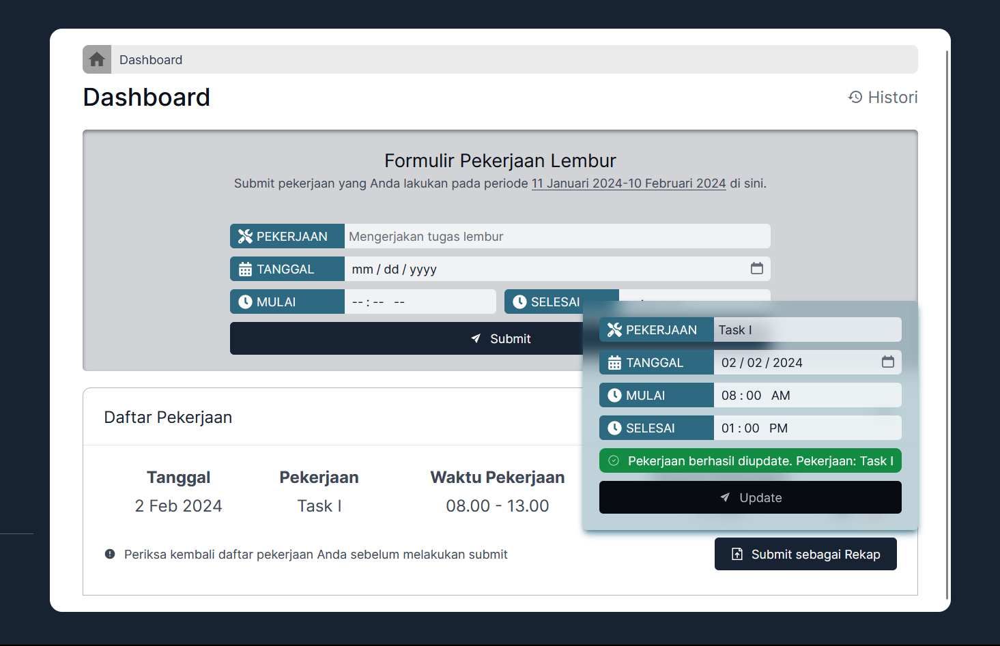

## Site

[overtimesystem.vercel.app](https://overtimesystem.vercel.app)

## Requirements

1. Authentication and authorization: users and admins can login by using their credentials. Admins get a special access to the admin panel.
2. Users can submit a new working item, also can update and delete an existing one.
3. Users can submit a list of submitted working items to get reviewed and approved.
4. Admin can review and approve working items submitted by users.
5. Admin can export the list of working items of each users to get a recap in PDF and Excel format.

## Use Cases

### Authentication and Authorization

#### Login Page

#### Navigation for Users

#### Navigation for Admin

### Users Managing Working Items

#### Submitting a New Working Item

#### Updating an Existing Working Item

#### Deleting a Working Item

### Users Managing the List of Working Items

### Admin Reviewing and Approving Working Items from Users

### Admin Exporting List of Working Items to PDF and Excel

## Acknowledgement

This documentation is written for portfolio purposes.
