## Background Scenario

A project manager wants to track the progress of tasks conducted by his subordinates. He decides to ask a developer to create a simple to-do app to oversee their performance.

## Requirements

The to-do app should have the following features:

1. User authentication
2. The user can add, edit, or delete a project.
3. The user can add, edit, or delete tasks that belong to specific projects.
4. Each task should have a tag/label to indicate which project it belongs to.
5. The user can view all tasks as a list on the home page.
6. The user can filter the task list by each project.

## Program Scheme


### START

1. The user creates an account if they don't already have one, then logs in.
2. The user can add a new project or task.
3. The user can edit a project or task.
4. The user can delete a project or task.
5. The user can mark a task as done/finished, either by clicking a button or dragging the task.
6. The user can filter the task list by their respective project.

### END

## Demo

<https://mad4869.pythonanywhere.com>

## ERD

This app utilizes __PostgreSQL__ as the database service. The structure of the schema in the database is as follows:


## Installation

### 1. Clone the repo

```bash
git clone https://github.com/mad4869/todo-app.git
```

### 2. Set up the enviromental variables

Create a new file named `.env` in the root directory of the app. Then, inside the `.env` file, add the required variables:

```env
FLASK_APP='run.py'
FLASK_DEBUG=1
ENVIRONMENT="development"
SECRET_KEY="some_secret_key"

POSTGRES_USER="postgres"
POSTGRES_PASSWORD="password"
POSTGRES_HOST="localhost"
POSTGRES_PORT="5432"
POSTGRES_DB="todo-db"

JWT_SECRET_KEY="some_secret_key"
```

Replace the example variables with the corresponding actual values as needed.

### 3. Create a virtual environment (optional)

### 4. Install the dependencies

```bash
pip install -r requirements.txt
npm install
```

### 5. Build the static assets

```bash
npm run build
flask digest compile
```

### 6. Connect to the database

```bash
flask db init
flask db migrate
flask db upgrade
```

### 7. Run the app

```bash
flask run
```

## Code Explanation

### 1. Backend

The to-do app is built using the `Flask` framework. The entry point of the app is `run.py`, and the app directory is named `todo` Additionally, the app utilizes several supporting libraries, including:

- `SQLAlchemy` for object-relational mapping (ORM).
- `flask-migrate` to manage database migrations.
- `flask-bcrypt` for generating password hashes.
- `flask-jwt-extended` for authentication and authorization using JSON Web Tokens (JWT).
- `flask-login` for managing user sessions.
- `flask-static-digest` for compiling static assets.
- `flask-wtf` for managing forms and their validation

Inside the todo module, the following files are present:

- `__init__.py:` Initialization file.
- `config.py:` App configuration.
- `extensions.py:` Initialization file for the app's supporting libraries.
- `forms.py:` Contains all the forms used in the app.
- `models.py:` Defines the models used to connect to the database.

The `todo` module also includes the following directories:

#### routes

- `api:` Handling the routes that serve the data. The list of API endpoints can be viewed [here.](https://documenter.getpostman.com/view/11633108/2s93zH2eWg)
- `auth:` Handling the routes for authentication.
- `views:` Handling the routes for rendering HTML templates.

#### static

Contains all the static assets (e.g., CSS, JavaScript, images).

#### templates

Contains HTML templates used for rendering web pages.

### 2. Frontend

This app utilizes __webpack__ to build the assets and insert them into the `static` directory within the `todo` module. Additionally, the app utilizes __Tailwind CSS__ as the CSS framework.

## Test Case

### 1. User authentication

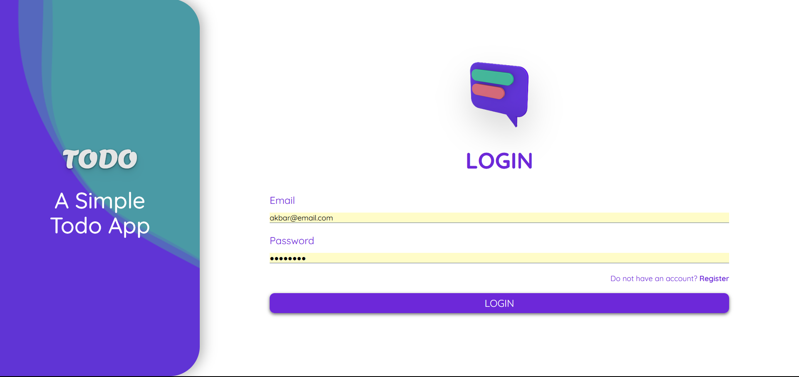


### 2. Add a project and a task

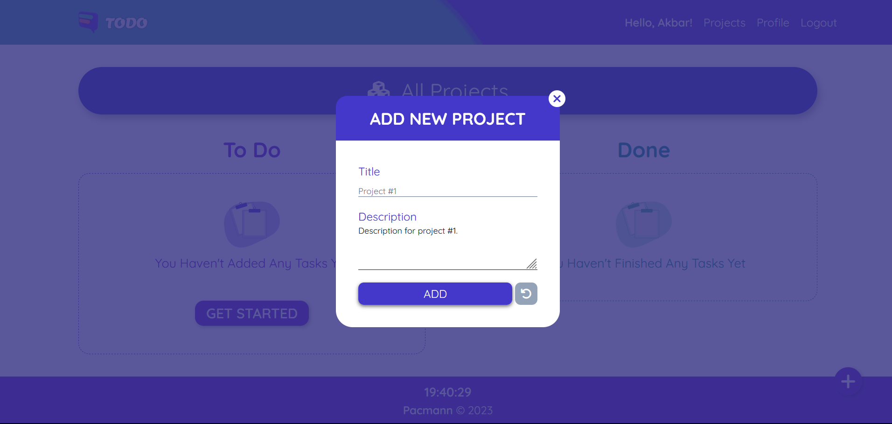
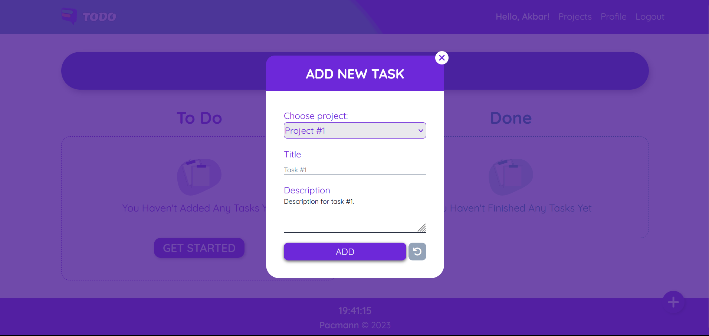
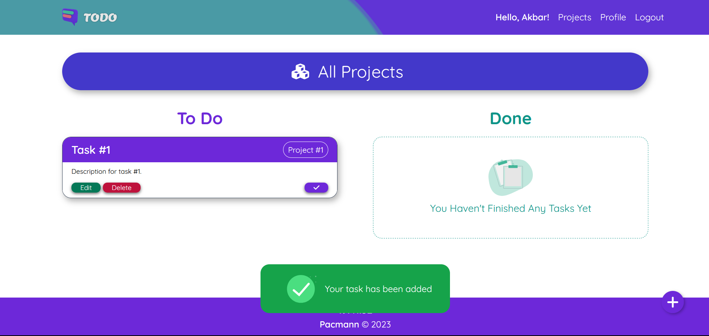

### 3. Edit a project and a task

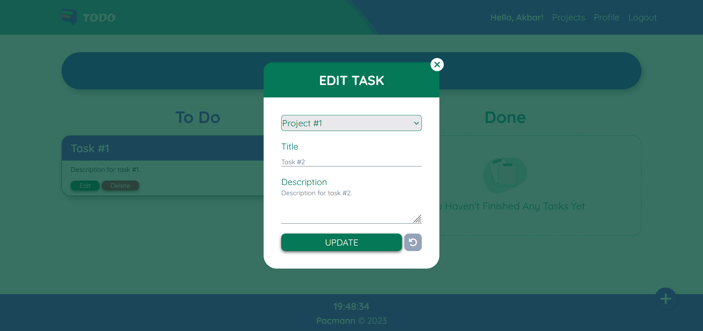
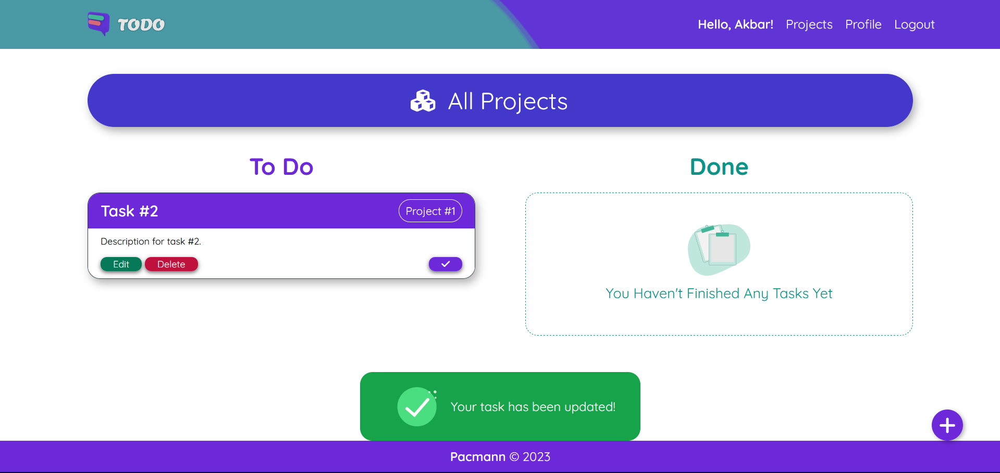
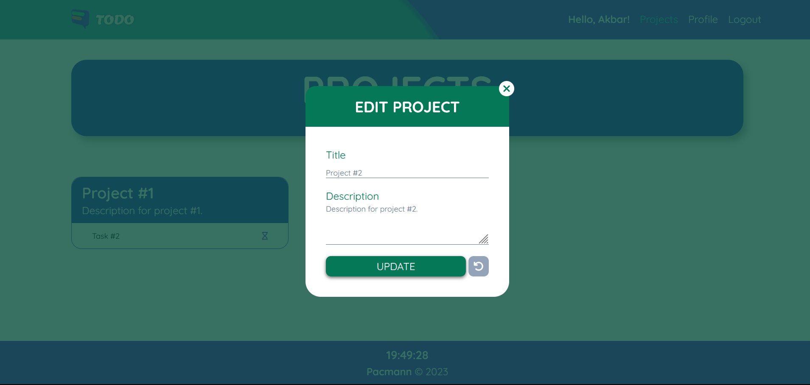
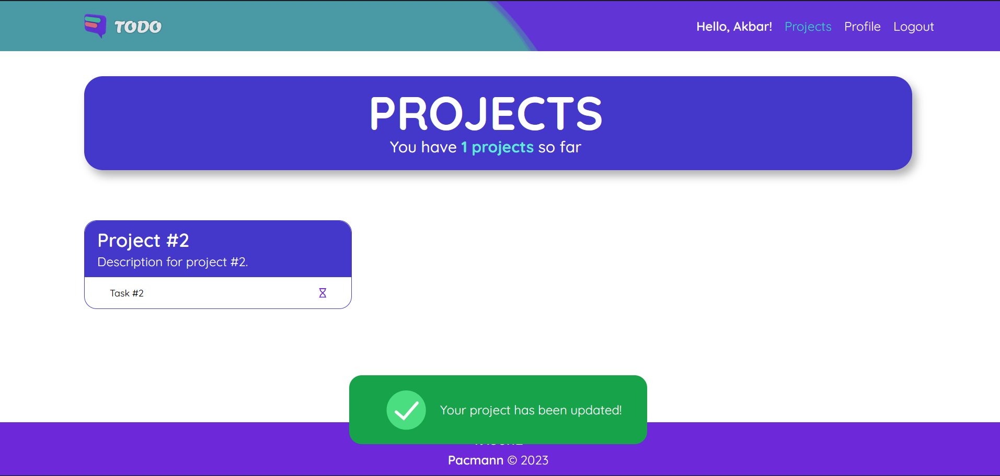

### 4. Delete a project and a task

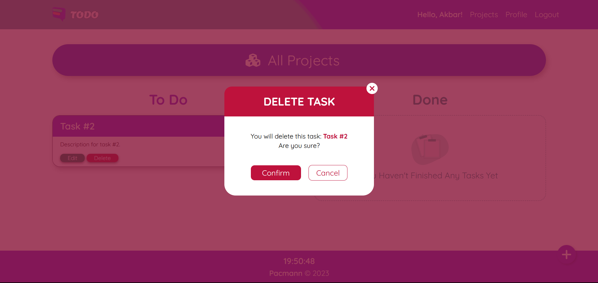
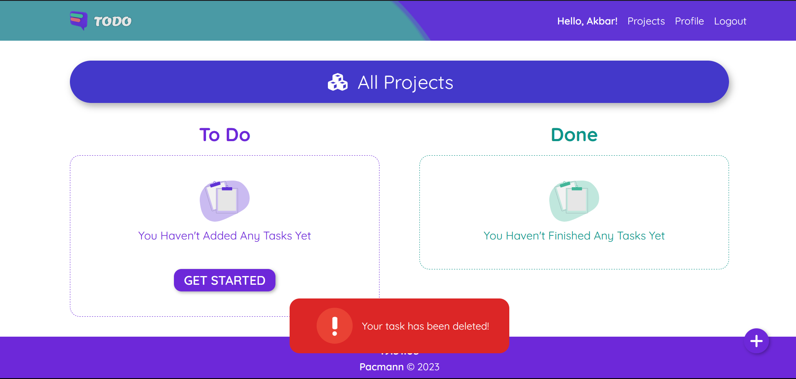
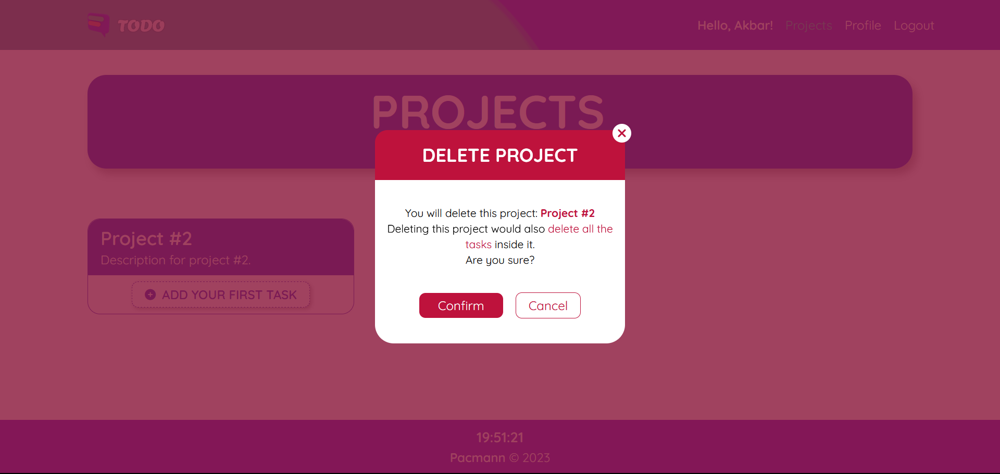


### 5. Mark a task as finished/done

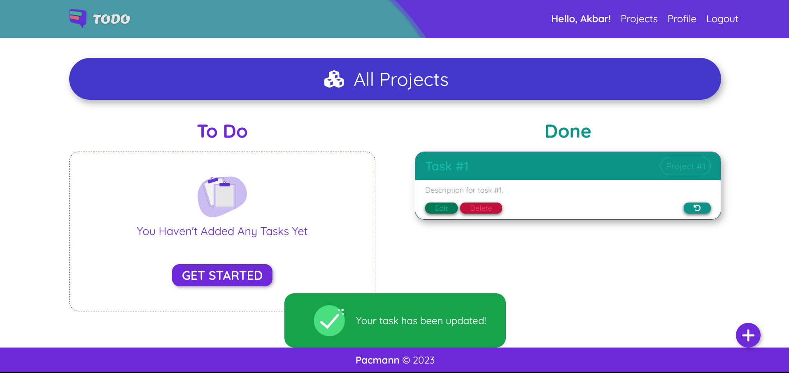

### 6. Filter tasks by project

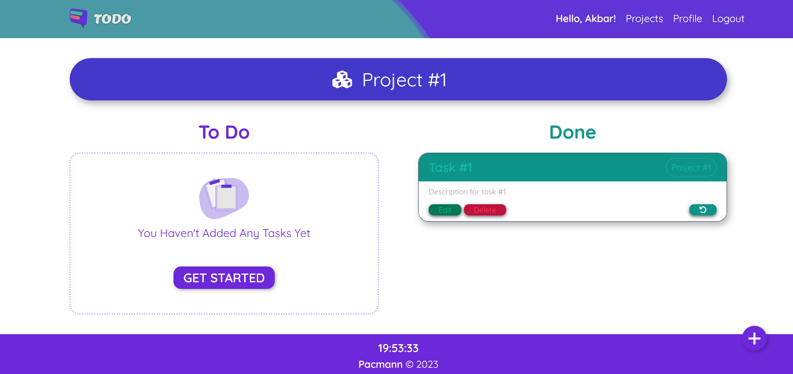
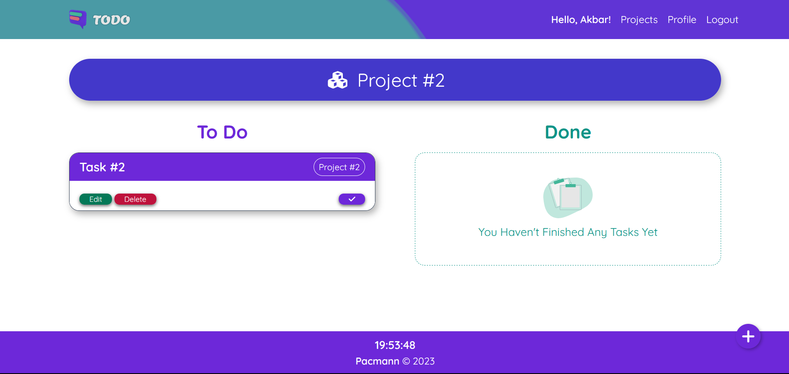

## Conclusion

TODO is a simple to-do app that allows users to track their tasks or projects. However, there are a few things that can be done to enhance the app:

1. Implement task pagination to improve the user experience.
2. Optimize the static files to enhance the app's performance.
3. Clean up the code to improve its overall readability.

By implementing these improvements, the overall functionality and performance of the app can be enhanced.
